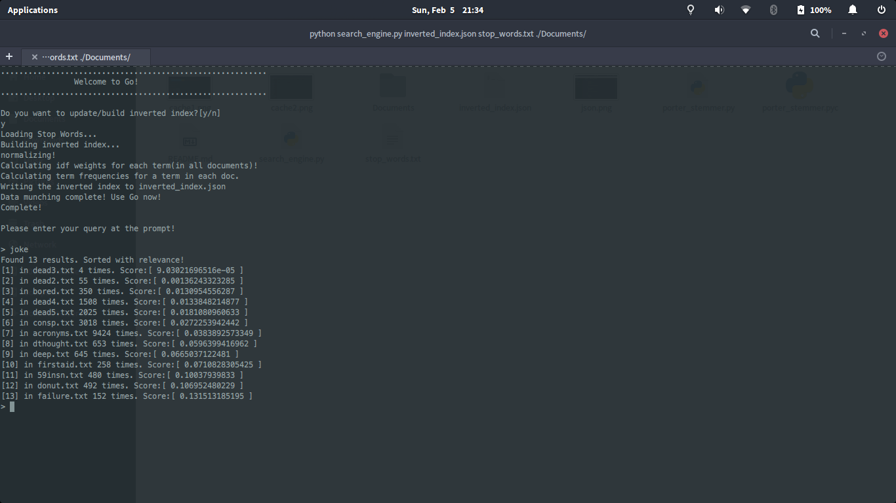
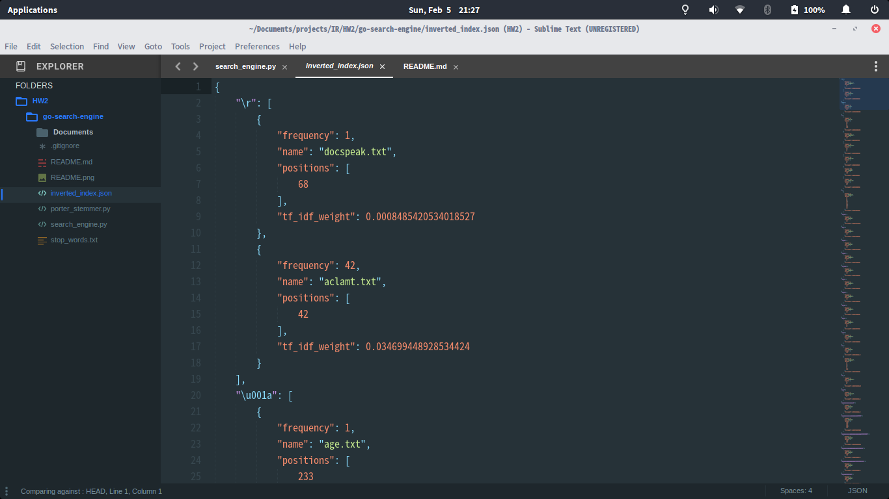
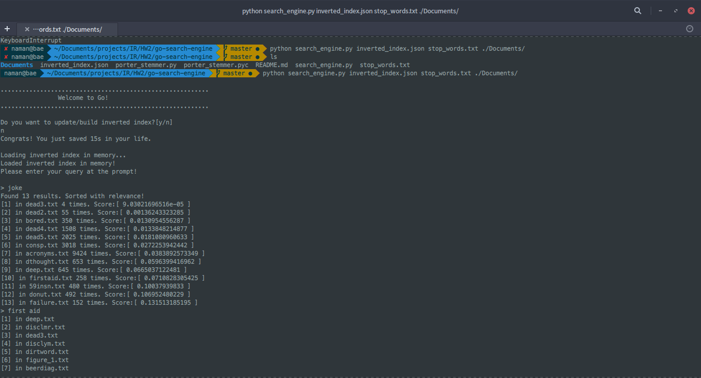
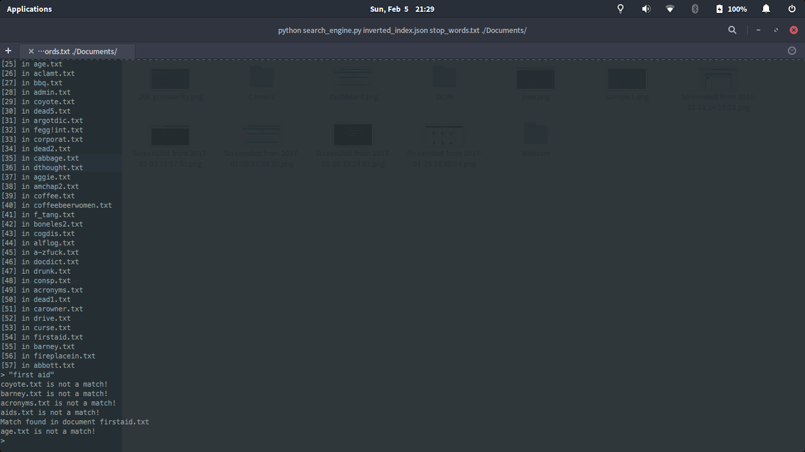

# Go: Search Engine
A basic search engine using jacard/cosine similarity and tf-idf score for Wikipedia Q/A. 
[Naman Gupta, 2013064]

# Screenshots

# References

1. Porter stemmer from https://tartarus.org/~martin/PorterStemmer/
2. http://www.cs.cmu.edu/~ark/QA-data/

# Usage

`python search_engine_1.py <inverted_index> <stop_words> <path_to_docs>`
`python search_engine_2.py <inverted_index> <stop_words> <path_to_docs>`

`python search_engine_1.py inverted_index.json stop_words.txt ./Documents/` part 1
`python search_engine_2.py inverted_index.json stop_words.txt ./Documents/` part 2, inverted word index
`python search_engine_2.py file_sentences.json stop_words.txt ./Documents/` part 2, inverted sentence index

# Features Implemented

1. For part 1: Uses cosine and jacard similarity to fetch questions for the answers in answer corpus.
2. For part 2: It uses tf-idf to retrieve ranked results of possible documents which may contain the answer to the question. A faster method/alternative was used which splits senteces (with the help of nltk) and matches the query with every sentence in every doc.  
3. Cutoffs used for Jaccard and Cosine similarity is 0.4 +- 0.0001. 
4. Stores the inverted index (both inverted word index, and inverted sentence index) as a json allowing offline caching (saves precious time 7 minutes required to build inverted index, power and those CPU cycles on building the index again) (see `build_index()`, `load_index_in_memory()` and `write_to_file()`). The 
	The inverted index json stores as follows 
	
		term: {
			doc_name,
			frequency,
			score,
			positions[]
		}
	While, the sentence index json stores the following

		[
			doc_name: {
				sentences[]
			}
		]

5. For part 2: Logic for tf-idf ranked matching `MultiWordQ()` function: Search for the each query term in the inverted index. Take a union of results. Make a set. The output is the list of documents that contain any of the query terms. Sorted according to tf-idf scores/relevance.

6. The query can be entered iteratively just like a normal shell. A prompt is visible where the query is entered and results are shown almost instantaneosly.
